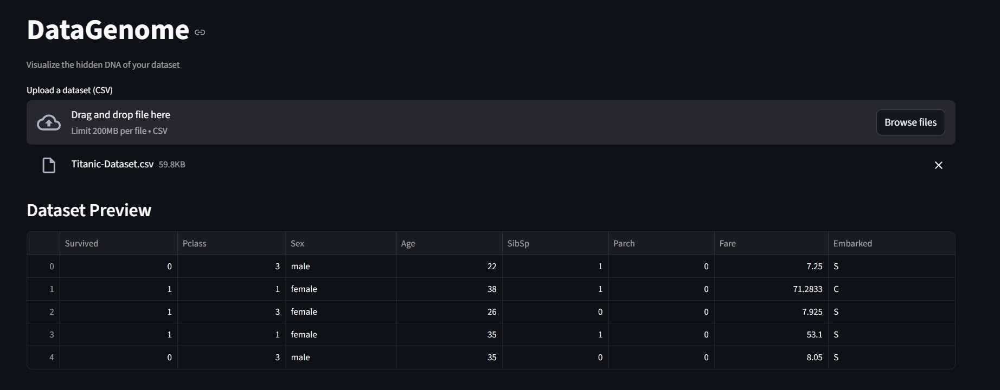
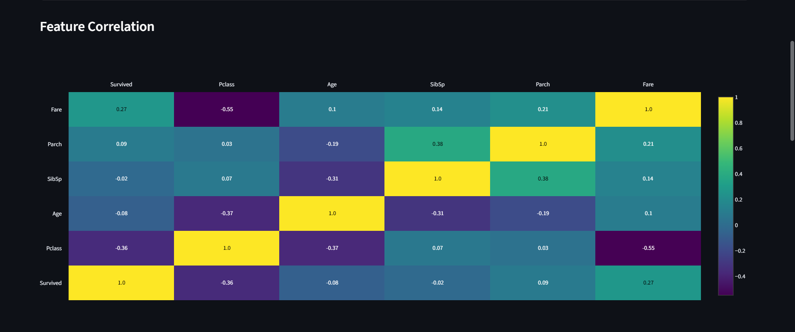
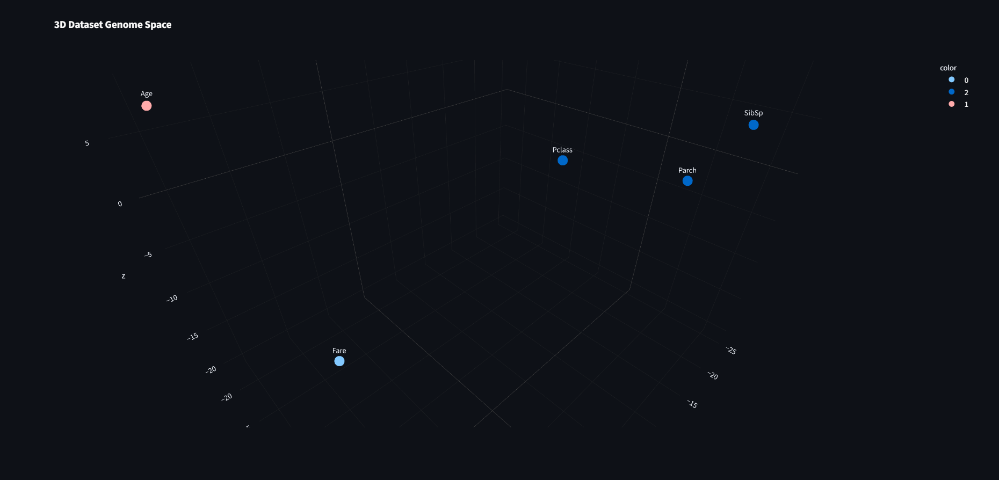
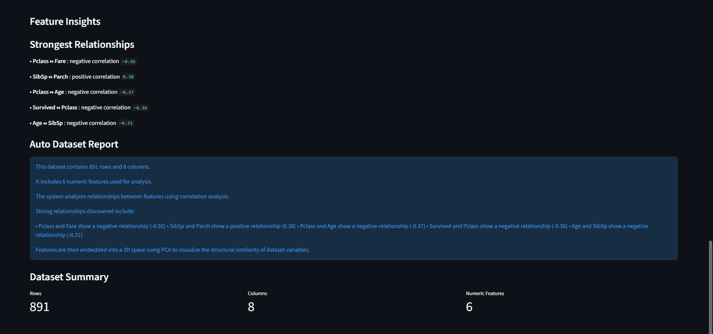

# DataGenome

AI-powered exploratory data analysis platform for discovering hidden relationships between dataset features using correlation analysis, PCA-based 3D visualization, clustering, and automated dataset reports.

---

# Overview

DataGenome is an interactive data analysis tool that helps users understand the hidden structure of datasets through visual analytics.

Instead of manually inspecting spreadsheets, users can upload a CSV dataset and instantly explore feature relationships, correlation patterns, 3D feature embeddings, clustering results, and automatically generated insights.

---

# Problem

Understanding relationships between variables in large datasets can be difficult using traditional spreadsheets. Hidden correlations, similar feature groups, and overall dataset structure are often overlooked during exploratory data analysis.

---

# Solution

DataGenome automates exploratory data analysis by combining statistical correlation analysis, Principal Component Analysis (PCA), feature clustering, and interactive visualizations into a single application.

It transforms raw datasets into intuitive visual insights that make feature exploration faster and more interpretable.

---

# Features

- Upload CSV datasets
- Instant dataset preview
- Correlation heatmap visualization
- PCA-powered 3D feature genome map
- Automatic feature clustering using KMeans
- Auto-generated dataset report
- Dataset summary statistics
- Interactive Plotly visualizations

---

# Architecture

```text
CSV Dataset
      │
      ▼
Dataset Loader
      │
      ▼
Preprocessing
      │
 ┌────┴───────────┐
 │                │
 ▼                ▼
Correlation     PCA Projection
Analysis
 │                │
 ▼                ▼
Heatmap      3D Genome Map
 │                │
 └──────┬─────────┘
        ▼
 Feature Clustering
 (KMeans)
        ▼
 Auto Dataset Report
```

---

# Technology Stack

| Layer | Technology |
|-------|------------|
| Language | Python |
| Framework | Streamlit |
| Data Processing | Pandas, NumPy |
| Machine Learning | Scikit-learn |
| Visualization | Plotly |

---

# Project Workflow

```
Upload CSV Dataset
        ↓
Preview Dataset
        ↓
Correlation Analysis
        ↓
PCA-based 3D Visualization
        ↓
Feature Clustering
        ↓
Automatic Dataset Report
```

---

# Screenshots

## Dataset Upload & Preview

Quickly upload any CSV dataset and inspect its contents before analysis.



---

## Correlation Heatmap

Visualize relationships between numerical features using a color-coded correlation matrix.



---

## 3D Genome Map

Project numerical features into a PCA-powered three-dimensional space to reveal structural similarity between variables.



---

## Automatic Dataset Report

Generate an AI-style summary describing important relationships, feature statistics, and overall dataset characteristics.



---

# Example Output

DataGenome automatically identifies:

- Strong positive correlations
- Strong negative correlations
- Similar feature clusters
- PCA-based feature positioning
- Dataset statistics
- Automatic textual interpretation of dataset structure

---

# Use Cases

- Exploratory Data Analysis (EDA)
- Feature engineering
- Dataset understanding
- Machine learning preprocessing
- Educational demonstrations
- Mini project presentations
- Research visualization

---

# Project Structure

```text
DataGenome/
│
├── app.py
├── requirements.txt
├── screenshots/
│   ├── preview.png
│   ├── heatmap.png
│   ├── genome3d.png
│   └── report.png
├── README.md
```

---

# Installation

Clone the repository

```bash
git clone https://github.com/PoojaSiv0211/DataGenome.git
```

Move into the project

```bash
cd DataGenome
```

Install dependencies

```bash
pip install -r requirements.txt
```

Run the application

```bash
streamlit run app.py
```

---

# Future Improvements

- t-SNE and UMAP visualizations
- AI-generated feature explanations
- Feature importance ranking
- Dataset comparison mode
- Downloadable PDF reports
- Interactive filtering options

---

# Author

**Pooja Sivaramalingam**

AI & Data Science Undergraduate

Building AI-powered tools for data visualization, healthcare, and knowledge systems.
